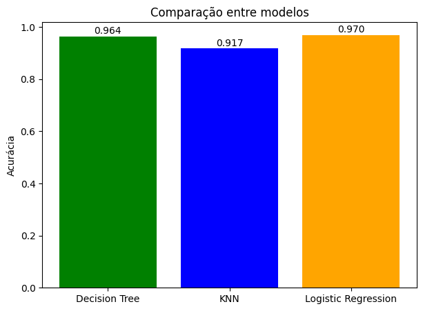
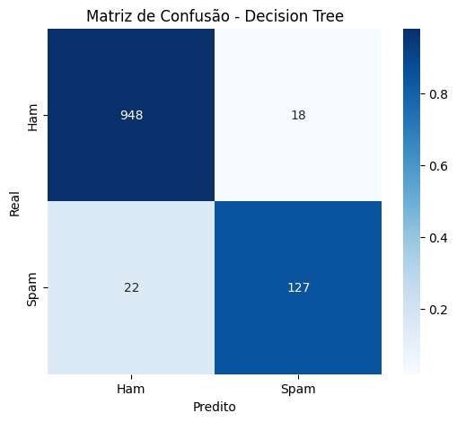
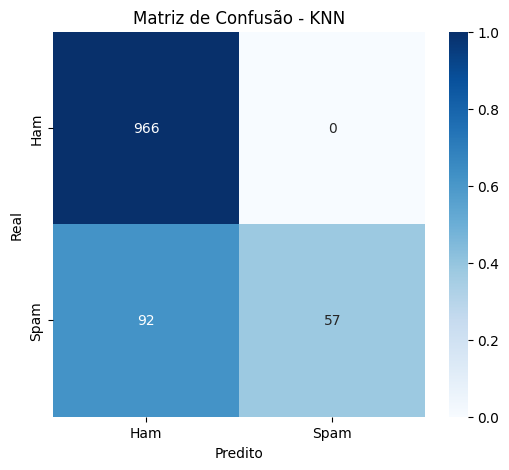
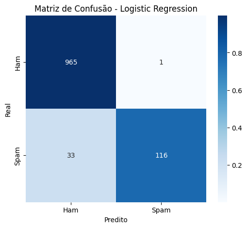

# SMS Spam Classification ✉️

Este projeto tem como objetivo desenvolver um modelo de Machine Learning para classificar mensagens SMS como **Spam** ou **Ham** (não spam).  
O dataset utilizado é o [SMS Spam Collection Dataset](https://www.kaggle.com/datasets/uciml/sms-spam-collection-dataset).

## Por que este _dataset_? 📊
Além de ter um tamanho gerenciável torno de 5500 mensagens, ele tem classes bem definidas (ham ou spam). E também a forma de como ele pode ser utilizado (detecção de spam em SMS). Por fim, ele atende todos os requisitos deste projeto.

## Tecnologias e Bibliotecas Utilizadas 🛠
- **Python 3**
- **pandas** e **numpy** – Manipulação e análise de dados
- **scikit-learn** – Treinamento de modelos, métricas e matrizes de confusão
- **matplotlib** e **seaborn** – Visualização de dados e gráficos

## O que foi possível ver e analisar? 🔎
Foi possível analisar as informações do dataset via pandas, separar os dados de treino e teste. Também foi possível realizar treinamentos usando a Decision Tree, KNN e a Logistic Regression.
Ao final do projeto, conseguimos realizar as predições de spam ou ham, medir váriaveis de desempenho, como:  Acurácia, recall e F1, por fim, temos a visualição em forma de gráficos comparativos e matrizes de confusão.

## Gráfico Comparativo 📈

## Matriz de Confusão - Decision Tree 📈

## Matriz de Confusão - KNN 📈

## Matriz de Confusão - Logistic Regression 📈

### Sobre a Atividade 📚
**Disciplina**: Inteligência Artifical.  
**Docente**: Ronierison de Souza Maciel.  
**Aluno**: Pablo Henrique Dantas de Sá.
